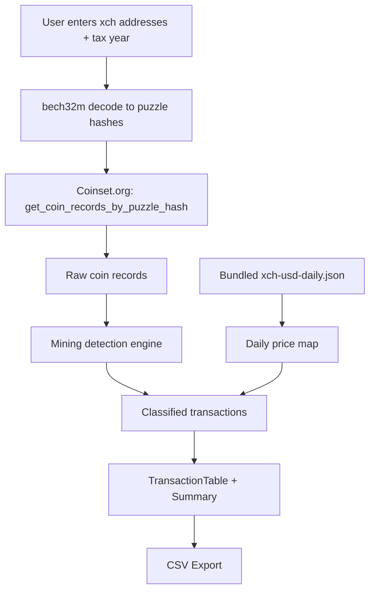

# Architecture

## Purpose

High-level system overview of Chia Mining Tax Calculator — a static, client-side React+TypeScript web application that calculates Chia (XCH) farming/mining income taxes.

## Key Concepts

- **No backend.** All processing happens in the browser. API calls go directly from the client to coinset.org; price data is bundled statically.
- **CORS-compatible.** The coinset.org API supports cross-origin requests, enabling the static-site approach.
- **Static hosting.** The built `dist/` folder deploys to GitHub Pages (or any static host).

## Data Flow



## Component Tree

```
App
├── Header
├── AboutSection (collapsible)
├── AddressInput
├── TaxYearSelector
├── Action buttons (Calculate, Refresh, Export)
├── ProgressPanel
├── Summary
├── TransactionTable
└── Footer (tip jar)
```

## File Map

- `src/App.tsx` — Main orchestrator, owns all state and the fetch/process pipeline
- `src/types.ts` — All shared TypeScript interfaces
- `src/services/` — API clients, caching, address codec, retry logic
- `src/components/` — Presentational React components
- `src/utils/` — Pure functions: CSV generation, mining heuristics, formatting
- `scripts/update-prices.ts` — Node script to regenerate bundled price data
- `public/data/xch-usd-daily.json` — Bundled historical XCH/USD prices

## Data Shapes

- **App state** — addresses, tax year, mining overrides, and derived `Transaction[]` live in React state (`src/App.tsx`); shared interfaces are in `src/types.ts`.
- **Raw chain data** — `RawCoinRecord[]` from coinset.org ([api-coinset.md](./api-coinset.md)).
- **Prices** — `PriceMap` (`YYYY-MM-DD` → USD) from CoinGecko and/or bundled JSON ([api-coingecko.md](./api-coingecko.md)).

## Edge Cases and Gotchas

- The app deduplicates transactions by coin ID when multiple addresses overlap
- Puzzle hashes are hex-encoded (no `0x` prefix) internally but sent with `0x` to coinset.org
- Price data is bundled statically; run `npm run update-prices` to refresh

## Extension Points

- Add new data sources by creating a new service in `src/services/` following the `fetchWithRetry` + cache pattern
- Add new export formats by adding a generator function in `src/utils/csv.ts`
- Add new transaction type classifications in `src/utils/mining.ts`
